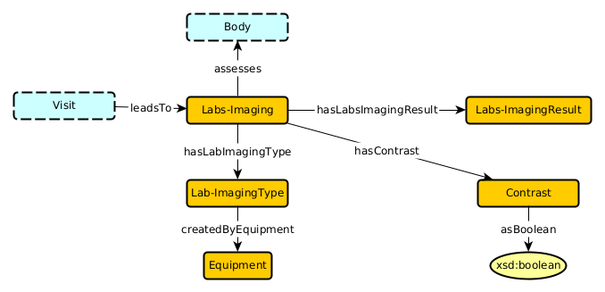

# DCH Medical Data Ontology

## Body

### Axioms

## `Body hasOrgan Organ`  
disjoint: `Body DisjointWith Organ`

domain: `hasOrgan some owl:Thing SubClassOf Body`  

global range: `owl:Thing SubClassOf hasOrgan only Organ`  

existential: `Body SubClassOf hasOrgan some Organ`  

## `Body hasLeg Leg`  
disjoint: `Body DisjointWith Leg`

domain: `hasLeg some owl:Thing SubClassOf Body`  

global range: `owl:Thing SubClassOf hasLeg only Leg`  

## `Body hasArm Arm`  
disjoint: `Body DisjointWith Arm`

domain: `hasArm some owl:Thing SubClassOf Body`  

global Range: `owl:Thing SubClassOf hasArm only Arm`  

## `Body hasTorso Torso`  
disjoint: `Body DisjointWith Torso`

domain: `hasTorso some owl:Thing SubClassOf Body`  

global range: `owl:Thing SubClassOf hasTorso only Torso`  

existential: `Body SubClassOf hasTorso some Torso`  

inverse existential: `Torso SubClassOf inverse hasTorso some Body`  

qualified scoped functionality: `Body SubClassOf hasTorso max 1 Torso`  

## `Body hasHead Head`  
disjoint: `Body DisjointWith Head`

domain: `hasHead some owl:Thing SubClassOf Body`  

global range: `owl:Thing SubClassOf hasHead only Head`  

qualified scoped functionality: `Body SubClassOf hasHead max 1 Head`  

## `Body hasHeight Height`  
disjoint: `Body DisjointWith Height`

global range: `owl:Thing SubClassOf hasHeight only Height`  

existential: `Body SubClassOf hasHeight some Height`  

qualified functionality: `owl:Thing SubClassOf hasHeight max 1 Height`  

## `Body hasWeight Weight`  
disjoint: `Body DisjointWith Weight`

global range: `owl:Thing SubClassOf hasWeight only Weight`  

existential: `Body SubClassOf hasWeight some Weight`  

qualified functionality: `owl:Thing SubClassOf hasWeight max 1 Weight`  

### Axioms Templates
subclass: `A SubClassOf B`  

disjointness: `A DisjointWith B`  

domain: `R some owl:Thing SubClassOf A`  

scoped domain: `R some B SubClassOf A`  

global range: `owl:Thing SubClassOf R only B`  

scoped range: `A SubClassOf R only B`  

existential: `A SubClassOf R some B`  

inverse existential: `B SubClassOf inverse R some A`  

functionality: `owl:Thing SubClassOf R max 1 owl:Thing`  

qualified functionality: `owl:Thing SubClassOf R max 1 B`  

scoped functionality: `A SubClassOf R max 1 owl:Thing`  

qualified scoped functionality: `A SubClassOf R max 1 B`  

inverse functionality: `owl:Thing SubClassOf inverse R max 1 owl:Thing`  

inverse qualified functionality: `owl:Thing SubClassOf inverse R max 1 A`  

inverse scoped functionality: `B SubClassOf inverse R max 1 owl:Thing`  

inverse qualified scoped functionality: `B SubClassOf inverse R max 1 A`  

structural tautology: `A SubClassOf R min 0 B`  

## Diagnosis

### Axioms

## Diagnosis hasPrincipalDiagnosis PrincipalDiagnosis
disjoint: `Diagnosis DisjointWith PrincipalDiagnosis`

existential: `Diagnosis SubClassOf hasPrincipalDiagnosis some PrincipalDiagnosis`

functionality: `owl:Thing SubClassOf hasPrincipalDiagnosis max 1 owl:Thing`

global domain: `hasPrincipalDiagnosis some owl:Thing SubClassOf Diagnosis`

global range: `owl:Thing SubClassOf hasPrincipalDiagnosis only PrincipalDiagnosis`

inverse existential: `PrincipalDiagnosis SubClassOf inverse hasPrincipalDiagnosis some Diagnosis`

inverse functionality: `owl:Thing SubClassOf inverse hasPrincipalDiagnosis max 1`

inverse qualified functionality: `owl:Thing SubClassOf inverse hasPrincipalDiagnosis max 1 Diagnosis`

inverse qualified scoped functionality: `PrincipalDiagnosis SubClassOf inverse hasPrincipalDiagnosis max 1 Diagnosis`

inverse scoped functionality: `PrincipalDiagnosis SubClassOf inverse hasPrincipalDiagnosis max 1 owl:Thing`

qualified functionality: `owl:Thing SubClassOf hasPrincipalDiagnosis max 1 PrincipalDiagnosis`

qualified scoped functionality: `Diagnosis SubClassOf hasPrincipalDiagnosis max 1 PrincipalDiagnosis`

scoped domain: `hasPrincipalDiagnosis some PrincipalDiagnosis SubClassOf Diagnosis`

scoped functionality: `Diagnosis SubClassOf hasPrincipalDiagnosis max 1 owl:Thing`

scoped range: `Diagnosis SubClassOf hasPrincipalDiagnosis some PrincipalDiagnosis`

structural tautology: `PrincipalDiagnosis SubClassOf hasPrincipalDiagnosis min 0 Diagnosis`

## Diagnosis hasDiagnosisTypes DiagnosisTypes
disjoint: `Diagnosis DisjointWith DiagnosisTypes`

existential: `Diagnosis SubClassOf hasDiagnosisTypes some DiagnosisTypes`

global domain: `hasDiagnosisTypes some owl:Thing SubClassOf Diagnosis`

global range: `owl:Thing SubClassOf hasDiagnosisTypes only DiagnosisTypes`

inverse existential: `DiagnosisTypes SubClassOf inverse hasDiagnosisTypes some Diagnosis`

scoped domain: `hasDiagnosisTypes some DiagnosisTypes SubClassOf Diagnosis`

scoped range: `Diagnosis SubClassOf hasDiagnosisTypes some DiagnosisTypes`

structural tautology: `DiagnosisTypes SubClassOf hasDiagnosisTypes min 0 Diagnosis`

## Diagnosis identifies Disease
disjoint: `Diagnosis DisjointWith Disease`

existential: `Diagnosis SubClassOf identifies some Disease`

global domain: `identifies some owl:Thing SubClassOf Diagnosis`

scoped domain: `identifies some Disease SubClassOf Diagnosis`

scoped range: `Diagnosis SubClassOf identifies some Disease`

structural tautology: `Disease SubClassOf identifies min 0 Diagnosis`

## Diagnosis affects Body
disjoint: `Diagnosis DisjointWith Body`

existential: `Diagnosis SubClassOf affects some Body`

scoped range: `Diagnosis SubClassOf affects some Body`

structural tautology: `Body SubClassOf affects min 0 Diagnosis`

## Diagnosis isAssociatedWith Visit
disjoint: `Diagnosis DisjointWith Visit`

existential: `Diagnosis SubClassOf isAssociatedWith some Visit`

scoped range: `Diagnosis SubClassOf isAssociatedWith some Visit`

structural tautology: `Visit SubClassOf isAssociatedWith min 0 Diagnosis`

## Patient hasDiagnosis Diagnosis
disjoint: `Patient DisjointWith Diagnosis`

existential: `Patient SubClassOf hasDiagnosis some Diagnosis`

global domain: `hasDiagnosis some owl:Thing SubClassOf Patient`

global range: `owl:Thing SubClassOf hasDiagnosis only Diagnosis`

inverse existential: `Diagnosis SubClassOf inverse hasDiagnosis some Patient`

scoped domain: `hasDiagnosis some Diagnosis SubClassOf Patient`

scoped range: `Patient SubClassOf hasDiagnosis some Diagnosis`

structural tautology: `Diagnosis SubClassOf hasDiagnosis min 0 Patient`

## Treatment treatmentFor Diagnosis
disjoint: `Treatment DisjointWith Diagnosis`

existential: `Treatment SubClassOf treatmentFor some Diagnosis`

global domain: `treatmentFor some owl:Thing SubClassOf Treatment`

scoped domain: `treatmentFor some Diagnosis SubClassOf Treatment`

structural tautology: `Diagnosis SubClassOf treatmentFor min 0 Treatment`

## Drug

### Axioms

## patient isAdministered Dosage
disjoint: `patient DisjointWith Dosage`

global domain: `isAdministered some owl:Thing SubClassOf patient`

inverse existential: `Dosage SubClassOf inverse isAdministered some patient`

scoped domain: `isAdministered some Dosage SubClassOf patient`

structural tautology: `Dosage SubClassOf isAdministered min 0 patient`

## Dosage hasDosageStrength DosageStrength
disjoint: `Dosage DisjointWith DosageStrength`

existential: `Dosage SubClassOf hasDosageStrength some DosageStrength`

global domain: `hasDosageStrength some owl:Thing SubClassOf Dosage`

global range: `owl:Thing SubClassOf hasDosageStrength only DosageStrength`

inverse existential: `DosageStrength SubClassOf inverse hasDosageStrength some Dosage`

scoped domain: `hasDosageStrength some DosageStrength SubClassOf Dosage`

scoped range: `Dosage SubClassOf hasDosageStrength some DosageStrength`

structural tautology: `DosageStrength SubClassOf hasDosageStrength min 0 Dosage`

## Dosage hasDosageForm DosageForm
disjoint: `Dosage DisjointWith DosageForm`

existential: `Dosage SubClassOf hasDosageForm some DosageForm`

global domain: `hasDosageForm some owl:Thing SubClassOf Dosage`

global range: `owl:Thing SubClassOf hasDosageForm only DosageForm`

inverse existential: `DosageForm SubClassOf inverse hasDosageForm some Dosage`

scoped domain: `hasDosageForm some DosageForm SubClassOf Dosage`

scoped range: `Dosage SubClassOf hasDosageForm some DosageForm`

structural tautology: `DosageForm SubClassOf hasDosageForm min 0 Dosage`

## Dosage hasQuantity Quantity
disjoint: `Dosage DisjointWith Quantity`

existential: `Dosage SubClassOf hasQuantity some Quantity`

scoped range: `Dosage SubClassOf hasQuantity some Quantity`

structural tautology: `Quantity SubClassOf hasQuantity min 0 Dosage`

## Drug hasDosage Dosage
disjoint: `Drug DisjointWith Dosage`

existential: `Drug SubClassOf hasDosage some Dosage`

global domain: `hasDosage some owl:Thing SubClassOf Drug`

global range: `owl:Thing SubClassOf hasDosage only Dosage`

inverse existential: `Dosage SubClassOf inverse hasDosage some Drug`

scoped domain: `hasDosage some Dosage SubClassOf Drug`

scoped range: `Drug SubClassOf hasDosage some Dosage`

structural tautology: `Dosage SubClassOf hasDosage min 0 Drug`

## Drug hasRouteOfAdministration RouteOfAdministration
disjoint: `Drug DisjointWith RouteOfAdministration`

existential: `Drug SubClassOf hasRouteOfAdministration some RouteOfAdministration`

global domain: `hasRouteOfAdministration some owl:Thing SubClassOf Drug`

global range: `owl:Thing SubClassOf hasRouteOfAdministration only RouteOfAdministration`

inverse existential: `RouteOfAdministration SubClassOf inverse hasRouteOfAdministration some Drug`

scoped domain: `hasRouteOfAdministration some RouteOfAdministration SubClassOf Drug`

scoped range: `Drug SubClassOf hasRouteOfAdministration some RouteOfAdministration`

structural tautology: `RouteOfAdministration SubClassOf hasRouteOfAdministration min 0 Drug`

## Drug affects Body
disjoint: `Drug DisjointWith Body`

existential: `Drug SubClassOf affects some Body`

## Drug affects Health
disjoint: `Drug DisjointWith Health`

existential: `Drug SubClassOf affects some Health`

## Drug hasSideEffect SideEffect
disjoint: `Drug DisjointWith SideEffect`

existential: `Drug SubClassOf hasSideEffect some SideEffect`

global domain: `hasSideEffect some owl:Thing SubClassOf Drug`

scoped range: `Drug SubClassOf hasSideEffect some SideEffect`

structural tautology: `SideEffect SubClassOf hasSideEffect min 0 Drug`

## SideEffect affects Health
disjoint: `SideEffect DisjointWith Health`

existential: `SideEffect SubClassOf affects some Health`

scoped range: `SideEffect SubClassOf affects some Health`

structural tautology: `Health SubClassOf affects min 0 SideEffect`

## Drug hasName DrugName
disjoint: `Drug DisjointWith DrugName`

global domain: `hasName some owl:Thing SubClassOf Drug`

scoped domain: `hasName some DrugName SubClassOf Drug`

## Drug hasDrugClass DrugClass
disjoint: `Drug DisjointWith DrugClass`

existential: `Drug SubClassOf hasDrugClass some DrugClass`

global domain: `hasDrugClass some owl:Thing SubClassOf Drug`

global range: `owl:Thing SubClassOf hasDrugClass only DrugClass`

inverse existential: `DrugClass SubClassOf inverse hasDrugClass some Drug`

scoped domain: `hasDrugClass some DrugClass SubClassOf Drug`

scoped range: `Drug SubClassOf hasDrugClass some DrugClass`

structural tautology: `DrugClass SubClassOf hasDrugClass min 0 Drug`

## Drug hasDrugName DrugName
existential: `Drug SubClassOf hasDrugName some DrugName`

global range: `owl:Thing SubClassOf hasDrugName only DrugName`

inverse existential: `DrugName SubClassOf inverse hasDrugName some Drug`

scoped range: `Drug SubClassOf hasDrugName some DrugName`

structural tautology: `DrugName SubClassOf hasDrugName min 0 Drug`

## Drug affects Body_or_Health
scoped range: `Drug SubClassOf affects some Body_or_Health`

structural tautology: `Body_or_Health SubClassOf affects min 0 Drug`

## Health

### Axioms

## Health hasHealthRecord HealthRecord
disjoint: `Health DisjointWith HealthRecord`

existential: `Health SubClassOf hasHealthRecord some HealthRecord`

global domain: `hasHealthRecord some owl:Thing SubClassOf Health`

global range: `owl:Thing SubClassOf hasHealthRecord only HealthRecord`

inverse existential: `HealthRecord SubClassOf inverse hasHealthRecord some Health`

scoped domain: `hasHealthRecord some HealthRecord SubClassOf Health`

scoped range: `Health SubClassOf hasHealthRecord some HealthRecord`

## Health hasHealthCondition HealthCondition
disjoint: `Health DisjointWith HealthCondition`

existential: `Health SubClassOf hasHealthCondition some HealthCondition`

global domain: `hasHealthCondition some owl:Thing SubClassOf Health`

global range: `owl:Thing SubClassOf hasHealthCondition only HealthCondition`

inverse existential: `HealthCondition SubClassOf inverse hasHealthCondition some Health`

scoped domain: `hasHealthCondition some HealthCondition SubClassOf Health`

scoped range: `Health SubClassOf hasHealthCondition some HealthCondition`

structural tautology: `HealthCondition SubClassOf hasHealthCondition min 0 Health`

## Health hasSymptom Symptom
disjoint: `Health DisjointWith Symptom`

existential: `Health SubClassOf hasSymptom some Symptom`

scoped domain: `hasSymptom some Symptom SubClassOf Health`

scoped range: `Health SubClassOf hasSymptom some Symptom`

structural tautology: `Symptom SubClassOf hasSymptom min 0 Health`

## Disease hasSymptom Symptom
disjoint: `Disease DisjointWith Symptom`

existential: `Disease SubClassOf hasSymptom some Symptom`

scoped domain: `hasSymptom some Symptom SubClassOf Disease`

scoped range: `Disease SubClassOf hasSymptom some Symptom`

structural tautology: `Symptom SubClassOf hasSymptom min 0 Disease`

## Symptom hasSeverity Severity
disjoint: `Symptom DisjointWith Severity`

existential: `Symptom SubClassOf hasSeverity some Severity`

functionality: `owl:Thing SubClassOf hasSeverity max 1 owl:Thing`

global domain: `hasSeverity some owl:Thing SubClassOf Symptom`

global range: `owl:Thing SubClassOf hasSeverity only Severity`

inverse existential: `Severity SubClassOf inverse hasSeverity some Symptom`

inverse functionality: `owl:Thing SubClassOf inverse hasSeverity max 1`

inverse qualified functionality: `owl:Thing SubClassOf inverse hasSeverity max 1 Symptom`

inverse qualified scoped functionality: `Severity SubClassOf inverse hasSeverity max 1 Symptom`

inverse scoped functionality: `Severity SubClassOf inverse hasSeverity max 1 owl:Thing`

qualified functionality: `owl:Thing SubClassOf hasSeverity max 1 Severity`

qualified scoped functionality: `Symptom SubClassOf hasSeverity max 1 Severity`

scoped domain: `hasSeverity some Severity SubClassOf Symptom`

scoped functionality: `Symptom SubClassOf hasSeverity max 1 owl:Thing`

scoped range: `Symptom SubClassOf hasSeverity some Severity`

## Disease hasTreatment Treatment
disjoint: `Disease DisjointWith Treatment`

existential: `Disease SubClassOf hasTreatment some Treatment`

global domain: `hasTreatment some owl:Thing SubClassOf Disease`

global range: `owl:Thing SubClassOf hasTreatment only Treatment`

inverse existential: `Treatment SubClassOf inverse hasTreatment some Disease`

scoped domain: `hasTreatment some Treatment SubClassOf Disease`

scoped range: `Disease SubClassOf hasTreatment some Treatment`

structural tautology: `Treatment SubClassOf hasTreatment min 0 Disease`

## Treatment includesService Service
disjoint: `Treatment DisjointWith Service`

existential: `Treatment SubClassOf includesService some Service`

global domain: `includesService some owl:Thing SubClassOf Treatment`

global range: `owl:Thing SubClassOf includesService only Service`

inverse existential: `Service SubClassOf inverse includesService some Treatment`

scoped domain: `includesService some Service SubClassOf Treatment`

scoped range: `Treatment SubClassOf includesService some Service`

structural tautology: `Service SubClassOf includesService min 0 Treatment`

## Treatment affects Health
disjoint: `Treatment DisjointWith Health`

existential: `Treatment SubClassOf affects some Health`

functionality: `owl:Thing SubClassOf affects max 1 owl:Thing`

inverse functionality: `owl:Thing SubClassOf inverse affects max 1`

inverse qualified functionality: `owl:Thing SubClassOf inverse affects max 1 Treatment`

qualified functionality: `owl:Thing SubClassOf affects max 1 Health`

qualified scoped functionality: `Treatment SubClassOf affects max 1 Health`

scoped domain: `affects some Health SubClassOf Treatment`

scoped functionality: `Treatment SubClassOf affects max 1 owl:Thing`

scoped range: `Treatment SubClassOf affects some Health`

structural tautology: `Health SubClassOf affects min 0 Treatment`

## Health hasStatus Status
disjoint: `Health DisjointWith Status`

existential: `Health SubClassOf hasStatus some Status`

inverse existential: `Status SubClassOf inverse hasStatus some Health`

inverse scoped functionality: `Status SubClassOf inverse hasStatus max 1 owl:Thing`

scoped domain: `hasStatus some Status SubClassOf Health`

scoped range: `Health SubClassOf hasStatus some Status`

structural tautology: `Status SubClassOf hasStatus min 0 Health`

## PhysicalHealth hasStatus PhysicalHealthStatus
disjoint: `PhysicalHealth DisjointWith PhysicalHealthStatus`

existential: `PhysicalHealth SubClassOf hasStatus some PhysicalHealthStatus`

inverse existential: `PhysicalHealthStatus SubClassOf inverse hasStatus some PhysicalHealth`

inverse qualified scoped functionality: `PhysicalHealthStatus SubClassOf inverse hasStatus max 1 PhysicalHealth`

inverse scoped functionality: `PhysicalHealthStatus SubClassOf inverse hasStatus max 1 owl:Thing`

qualified scoped functionality: `PhysicalHealth SubClassOf hasStatus max 1 PhysicalHealthStatus`

scoped domain: `hasStatus some PhysicalHealthStatus SubClassOf PhysicalHealth`

scoped range: `PhysicalHealth SubClassOf hasStatus some PhysicalHealthStatus`

## MentalHealth hasStatus MentalHealthStatus
disjoint: `MentalHealth DisjointWith MentalHealthStatus`

existential: `MentalHealth SubClassOf hasStatus some MentalHealthStatus`

inverse existential: `MentalHealthStatus SubClassOf inverse hasStatus some MentalHealth`

inverse qualified scoped functionality: `MentalHealthStatus SubClassOf inverse hasStatus max 1 MentalHealth`

inverse scoped functionality: `MentalHealthStatus SubClassOf inverse hasStatus max 1 owl:Thing`

qualified scoped functionality: `MentalHealth SubClassOf hasStatus max 1 MentalHealthStatus`

scoped domain: `hasStatus some MentalHealthStatus SubClassOf MentalHealth`

scoped range: `MentalHealth SubClassOf hasStatus some MentalHealthStatus`

structural tautology: `MentalHealthStatus SubClassOf hasStatus min 0 MentalHealth`

## Patient hasHealth Health
disjoint: `Patient DisjointWith Health`

existential: `Patient SubClassOf hasHealth some Health`

functionality: `owl:Thing SubClassOf hasHealth max 1 owl:Thing`

global domain: `hasHealth some owl:Thing SubClassOf Patient`

global range: `owl:Thing SubClassOf hasHealth only Health`

inverse existential: `Health SubClassOf inverse hasHealth some Patient`

inverse qualified scoped functionality: `Health SubClassOf inverse hasHealth max 1 Patient`

inverse scoped functionality: `Health SubClassOf inverse hasHealth max 1 owl:Thing`

qualified functionality: `owl:Thing SubClassOf hasHealth max 1 Health`

scoped domain: `hasHealth some Health SubClassOf Patient`

scoped functionality: `Patient SubClassOf hasHealth max 1 owl:Thing`

scoped range: `Patient SubClassOf hasHealth some Health`

## Health isAssociatedWith Visit
disjoint: `Health DisjointWith Visit`

existential: `Health SubClassOf isAssociatedWith some Visit`

global range: `owl:Thing SubClassOf isAssociatedWith only Visit`

inverse existential: `Visit SubClassOf inverse isAssociatedWith some Health`

inverse qualified scoped functionality: `Visit SubClassOf inverse isAssociatedWith max 1 Health`

inverse scoped functionality: `Visit SubClassOf inverse isAssociatedWith max 1 owl:Thing`

## Patient recieves Treatment
disjoint: `Patient DisjointWith Treatment`

existential: `Patient SubClassOf recieves some Treatment`

global domain: `recieves some owl:Thing SubClassOf Patient`

global range: `owl:Thing SubClassOf recieves only Treatment`

scoped domain: `recieves some Treatment SubClassOf Patient`

scoped range: `Patient SubClassOf recieves some Treatment`

structural tautology: `Treatment SubClassOf recieves min 0 Patient`

## MentalHealth SubClassOf Health
subclass: `MentalHealth SubClassOf Health`

## MentalHealthStatus SubClassOf Status
subclass: `MentalHealthStatus SubClassOf Status`

## PhysicalHealth SubClassOf Health
subclass: `PhysicalHealth SubClassOf Health`

## PhysicalHealthStatus SubClassOf Status
subclass: `PhysicalHealthStatus SubClassOf Status`

## Disease SubClassOf Health
subclass: `Disease SubClassOf Health`

## Labs-imaging

### Axioms

## Labs-Imaging assesses Body
disjoint: `Labs-Imaging DisjointWith Body`

existential: `Labs-Imaging SubClassOf assesses some Body`

functionality: `owl:Thing SubClassOf assesses max 1 owl:Thing`

inverse functionality: `owl:Thing SubClassOf inverse assesses max 1`

inverse qualified scoped functionality: `Body SubClassOf inverse assesses max 1 Labs-Imaging`

inverse scoped functionality: `Body SubClassOf inverse assesses max 1 owl:Thing`

qualified functionality: `owl:Thing SubClassOf assesses max 1 Body`

scoped domain: `assesses some Body SubClassOf Labs-Imaging`

structural tautology: `Body SubClassOf assesses min 0 Labs-Imaging`

## Labs-Imaging hasContrast Contrast
disjoint: `Labs-Imaging DisjointWith Contrast`

functionality: `owl:Thing SubClassOf hasContrast max 1 owl:Thing`

global domain: `hasContrast some owl:Thing SubClassOf Labs-Imaging`

global range: `owl:Thing SubClassOf hasContrast only Contrast`

inverse existential: `Contrast SubClassOf inverse hasContrast some Labs-Imaging`

inverse functionality: `owl:Thing SubClassOf inverse hasContrast max 1`

inverse qualified functionality: `owl:Thing SubClassOf inverse hasContrast max 1 Labs-Imaging`

inverse qualified scoped functionality: `Contrast SubClassOf inverse hasContrast max 1 Labs-Imaging`

inverse scoped functionality: `Contrast SubClassOf inverse hasContrast max 1 owl:Thing`

qualified functionality: `owl:Thing SubClassOf hasContrast max 1 Contrast`

qualified scoped functionality: `Labs-Imaging SubClassOf hasContrast max 1 Contrast`

scoped domain: `hasContrast some Contrast SubClassOf Labs-Imaging`

scoped functionality: `Labs-Imaging SubClassOf hasContrast max 1 owl:Thing`

scoped range: `Labs-Imaging SubClassOf hasContrast some Contrast`

structural tautology: `Contrast SubClassOf hasContrast min 0 Labs-Imaging`

## Labs-Imaging hasLabsImagingResult Labs-ImagingResult
disjoint: `Labs-Imaging DisjointWith Labs-ImagingResult`

existential: `Labs-Imaging SubClassOf hasLabsImagingResult some Labs-ImagingResult`

functionality: `owl:Thing SubClassOf hasLabsImagingResult max 1 owl:Thing`

global domain: `hasLabsImagingResult some owl:Thing SubClassOf Labs-Imaging`

global range: `owl:Thing SubClassOf hasLabsImagingResult only Labs-ImagingResult`

inverse existential: `Labs-ImagingResult SubClassOf inverse hasLabsImagingResult some Labs-Imaging`

inverse functionality: `owl:Thing SubClassOf inverse hasLabsImagingResult max 1`

inverse qualified functionality: `owl:Thing SubClassOf inverse hasLabsImagingResult max 1 Labs-Imaging`

qualified functionality: `owl:Thing SubClassOf hasLabsImagingResult max 1 Labs-ImagingResult`

qualified scoped functionality: `Labs-Imaging SubClassOf hasLabsImagingResult max 1 Labs-ImagingResult`

scoped domain: `hasLabsImagingResult some Labs-ImagingResult SubClassOf Labs-Imaging`

scoped range: `Labs-Imaging SubClassOf hasLabsImagingResult some Labs-ImagingResult`

## Labs-Imaging hasLabsImagingType Labs-ImagingType
disjoint: `Labs-Imaging DisjointWith Labs-ImagingType`

existential: `Labs-Imaging SubClassOf hasLabsImagingType some Labs-ImagingType`

functionality: `owl:Thing SubClassOf hasLabsImagingType max 1 owl:Thing`

global domain: `hasLabsImagingType some owl:Thing SubClassOf Labs-Imaging`

global range: `owl:Thing SubClassOf hasLabsImagingType only Labs-ImagingType`

inverse existential: `Labs-ImagingType SubClassOf inverse hasLabsImagingType some Labs-Imaging`

inverse functionality: `owl:Thing SubClassOf inverse hasLabsImagingType max 1`

inverse qualified functionality: `owl:Thing SubClassOf inverse hasLabsImagingType max 1 Labs-Imaging`

inverse qualified scoped functionality: `Labs-ImagingType SubClassOf inverse hasLabsImagingType max 1 Labs-Imaging`

inverse scoped functionality: `Labs-ImagingType SubClassOf inverse hasLabsImagingType max 1 owl:Thing`

qualified functionality: `owl:Thing SubClassOf hasLabsImagingType max 1 Labs-ImagingType`

qualified scoped functionality: `Labs-Imaging SubClassOf hasLabsImagingType max 1 Labs-ImagingType`

scoped domain: `hasLabsImagingType some Labs-ImagingType SubClassOf Labs-Imaging`

scoped range: `Labs-Imaging SubClassOf hasLabsImagingType some Labs-ImagingType`

## Labs-ImagingType createdByEquipment Equipment
disjoint: `Labs-ImagingType DisjointWith Equipment`

functionality: `owl:Thing SubClassOf createdByEquipment max 1 owl:Thing`

global domain: `createdByEquipment some owl:Thing SubClassOf Labs-ImagingType`

global range: `owl:Thing SubClassOf createdByEquipment only Equipment`

inverse existential: `Equipment SubClassOf inverse createdByEquipment some Labs-ImagingType`

inverse functionality: `owl:Thing SubClassOf inverse createdByEquipment max 1`

inverse qualified scoped functionality: `Equipment SubClassOf inverse createdByEquipment max 1 Labs-ImagingType`

inverse scoped functionality: `Equipment SubClassOf inverse createdByEquipment max 1 owl:Thing`

scoped domain: `createdByEquipment some Equipment SubClassOf Labs-ImagingType`

scoped functionality: `Labs-ImagingType SubClassOf createdByEquipment max 1 owl:Thing`

scoped range: `Labs-ImagingType SubClassOf createdByEquipment some Equipment`

## Visit leadsTo Labs-Imaging
disjoint: `Visit DisjointWith Labs-Imaging`

inverse existential: `Labs-Imaging SubClassOf inverse leadsTo some Visit`

inverse qualified scoped functionality: `Labs-Imaging SubClassOf inverse leadsTo max 1 Visit`

inverse scoped functionality: `Labs-Imaging SubClassOf inverse leadsTo max 1 owl:Thing`

## Labs-Imaging hasResult Result
inverse qualified scoped functionality: `Result SubClassOf inverse hasResult max 1 Labs-Imaging`

structural tautology: `Result SubClassOf hasResult min 0 Labs-Imaging`

## Labs-Imaging hasResult Labs-ImagingResult
inverse scoped functionality: `Labs-ImagingResult SubClassOf inverse hasResult max 1 owl:Thing`

## Labs-Imaging hasType Type
structural tautology: `Type SubClassOf hasType min 0 Labs-Imaging`

## Type hasEquipment Equipment
structural tautology: `Equipment SubClassOf hasEquipment min 0 Type`

