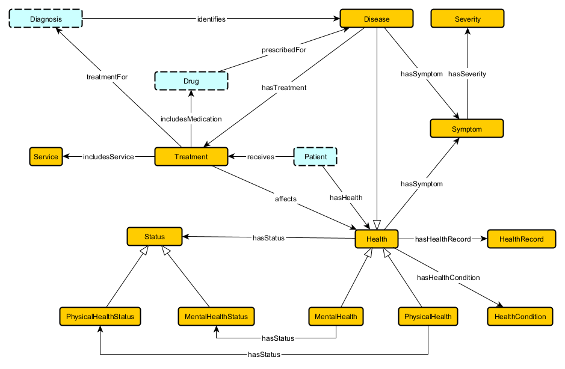

## Health

### Axioms

## Health hasHealthRecord HealthRecord
disjoint: `Health DisjointWith HealthRecord`

existential: `Health SubClassOf hasHealthRecord some HealthRecord`

global domain: `hasHealthRecord some owl:Thing SubClassOf Health`

global range: `owl:Thing SubClassOf hasHealthRecord only HealthRecord`

inverse existential: `HealthRecord SubClassOf inverse hasHealthRecord some Health`

scoped domain: `hasHealthRecord some HealthRecord SubClassOf Health`

scoped range: `Health SubClassOf hasHealthRecord some HealthRecord`

## Health hasHealthCondition HealthCondition
disjoint: `Health DisjointWith HealthCondition`

existential: `Health SubClassOf hasHealthCondition some HealthCondition`

global domain: `hasHealthCondition some owl:Thing SubClassOf Health`

global range: `owl:Thing SubClassOf hasHealthCondition only HealthCondition`

inverse existential: `HealthCondition SubClassOf inverse hasHealthCondition some Health`

scoped domain: `hasHealthCondition some HealthCondition SubClassOf Health`

scoped range: `Health SubClassOf hasHealthCondition some HealthCondition`

structural tautology: `HealthCondition SubClassOf hasHealthCondition min 0 Health`

## Health hasSymptom Symptom
disjoint: `Health DisjointWith Symptom`

existential: `Health SubClassOf hasSymptom some Symptom`

scoped domain: `hasSymptom some Symptom SubClassOf Health`

scoped range: `Health SubClassOf hasSymptom some Symptom`

structural tautology: `Symptom SubClassOf hasSymptom min 0 Health`

## Disease hasSymptom Symptom
disjoint: `Disease DisjointWith Symptom`

existential: `Disease SubClassOf hasSymptom some Symptom`

scoped domain: `hasSymptom some Symptom SubClassOf Disease`

scoped range: `Disease SubClassOf hasSymptom some Symptom`

structural tautology: `Symptom SubClassOf hasSymptom min 0 Disease`

## Symptom hasSeverity Severity
disjoint: `Symptom DisjointWith Severity`

existential: `Symptom SubClassOf hasSeverity some Severity`

functionality: `owl:Thing SubClassOf hasSeverity max 1 owl:Thing`

global domain: `hasSeverity some owl:Thing SubClassOf Symptom`

global range: `owl:Thing SubClassOf hasSeverity only Severity`

inverse existential: `Severity SubClassOf inverse hasSeverity some Symptom`

inverse functionality: `owl:Thing SubClassOf inverse hasSeverity max 1`

inverse qualified functionality: `owl:Thing SubClassOf inverse hasSeverity max 1 Symptom`

inverse qualified scoped functionality: `Severity SubClassOf inverse hasSeverity max 1 Symptom`

inverse scoped functionality: `Severity SubClassOf inverse hasSeverity max 1 owl:Thing`

qualified functionality: `owl:Thing SubClassOf hasSeverity max 1 Severity`

qualified scoped functionality: `Symptom SubClassOf hasSeverity max 1 Severity`

scoped domain: `hasSeverity some Severity SubClassOf Symptom`

scoped functionality: `Symptom SubClassOf hasSeverity max 1 owl:Thing`

scoped range: `Symptom SubClassOf hasSeverity some Severity`

## Disease hasTreatment Treatment
disjoint: `Disease DisjointWith Treatment`

existential: `Disease SubClassOf hasTreatment some Treatment`

global domain: `hasTreatment some owl:Thing SubClassOf Disease`

global range: `owl:Thing SubClassOf hasTreatment only Treatment`

inverse existential: `Treatment SubClassOf inverse hasTreatment some Disease`

scoped domain: `hasTreatment some Treatment SubClassOf Disease`

scoped range: `Disease SubClassOf hasTreatment some Treatment`

structural tautology: `Treatment SubClassOf hasTreatment min 0 Disease`

## Treatment includesService Service
disjoint: `Treatment DisjointWith Service`

existential: `Treatment SubClassOf includesService some Service`

global domain: `includesService some owl:Thing SubClassOf Treatment`

global range: `owl:Thing SubClassOf includesService only Service`

inverse existential: `Service SubClassOf inverse includesService some Treatment`

scoped domain: `includesService some Service SubClassOf Treatment`

scoped range: `Treatment SubClassOf includesService some Service`

structural tautology: `Service SubClassOf includesService min 0 Treatment`

## Treatment affects Health
disjoint: `Treatment DisjointWith Health`

existential: `Treatment SubClassOf affects some Health`

functionality: `owl:Thing SubClassOf affects max 1 owl:Thing`

inverse functionality: `owl:Thing SubClassOf inverse affects max 1`

inverse qualified functionality: `owl:Thing SubClassOf inverse affects max 1 Treatment`

qualified functionality: `owl:Thing SubClassOf affects max 1 Health`

qualified scoped functionality: `Treatment SubClassOf affects max 1 Health`

scoped domain: `affects some Health SubClassOf Treatment`

scoped functionality: `Treatment SubClassOf affects max 1 owl:Thing`

scoped range: `Treatment SubClassOf affects some Health`

structural tautology: `Health SubClassOf affects min 0 Treatment`

## Health hasStatus Status
disjoint: `Health DisjointWith Status`

existential: `Health SubClassOf hasStatus some Status`

inverse existential: `Status SubClassOf inverse hasStatus some Health`

inverse scoped functionality: `Status SubClassOf inverse hasStatus max 1 owl:Thing`

scoped domain: `hasStatus some Status SubClassOf Health`

scoped range: `Health SubClassOf hasStatus some Status`

structural tautology: `Status SubClassOf hasStatus min 0 Health`

## PhysicalHealth hasStatus PhysicalHealthStatus
disjoint: `PhysicalHealth DisjointWith PhysicalHealthStatus`

existential: `PhysicalHealth SubClassOf hasStatus some PhysicalHealthStatus`

inverse existential: `PhysicalHealthStatus SubClassOf inverse hasStatus some PhysicalHealth`

inverse qualified scoped functionality: `PhysicalHealthStatus SubClassOf inverse hasStatus max 1 PhysicalHealth`

inverse scoped functionality: `PhysicalHealthStatus SubClassOf inverse hasStatus max 1 owl:Thing`

qualified scoped functionality: `PhysicalHealth SubClassOf hasStatus max 1 PhysicalHealthStatus`

scoped domain: `hasStatus some PhysicalHealthStatus SubClassOf PhysicalHealth`

scoped range: `PhysicalHealth SubClassOf hasStatus some PhysicalHealthStatus`

## MentalHealth hasStatus MentalHealthStatus
disjoint: `MentalHealth DisjointWith MentalHealthStatus`

existential: `MentalHealth SubClassOf hasStatus some MentalHealthStatus`

inverse existential: `MentalHealthStatus SubClassOf inverse hasStatus some MentalHealth`

inverse qualified scoped functionality: `MentalHealthStatus SubClassOf inverse hasStatus max 1 MentalHealth`

inverse scoped functionality: `MentalHealthStatus SubClassOf inverse hasStatus max 1 owl:Thing`

qualified scoped functionality: `MentalHealth SubClassOf hasStatus max 1 MentalHealthStatus`

scoped domain: `hasStatus some MentalHealthStatus SubClassOf MentalHealth`

scoped range: `MentalHealth SubClassOf hasStatus some MentalHealthStatus`

structural tautology: `MentalHealthStatus SubClassOf hasStatus min 0 MentalHealth`

## Patient hasHealth Health
disjoint: `Patient DisjointWith Health`

existential: `Patient SubClassOf hasHealth some Health`

functionality: `owl:Thing SubClassOf hasHealth max 1 owl:Thing`

global domain: `hasHealth some owl:Thing SubClassOf Patient`

global range: `owl:Thing SubClassOf hasHealth only Health`

inverse existential: `Health SubClassOf inverse hasHealth some Patient`

inverse qualified scoped functionality: `Health SubClassOf inverse hasHealth max 1 Patient`

inverse scoped functionality: `Health SubClassOf inverse hasHealth max 1 owl:Thing`

qualified functionality: `owl:Thing SubClassOf hasHealth max 1 Health`

scoped domain: `hasHealth some Health SubClassOf Patient`

scoped functionality: `Patient SubClassOf hasHealth max 1 owl:Thing`

scoped range: `Patient SubClassOf hasHealth some Health`

## Health isAssociatedWith Visit
disjoint: `Health DisjointWith Visit`

existential: `Health SubClassOf isAssociatedWith some Visit`

global range: `owl:Thing SubClassOf isAssociatedWith only Visit`

inverse existential: `Visit SubClassOf inverse isAssociatedWith some Health`

inverse qualified scoped functionality: `Visit SubClassOf inverse isAssociatedWith max 1 Health`

inverse scoped functionality: `Visit SubClassOf inverse isAssociatedWith max 1 owl:Thing`

## Patient recieves Treatment
disjoint: `Patient DisjointWith Treatment`

existential: `Patient SubClassOf recieves some Treatment`

global domain: `recieves some owl:Thing SubClassOf Patient`

global range: `owl:Thing SubClassOf recieves only Treatment`

scoped domain: `recieves some Treatment SubClassOf Patient`

scoped range: `Patient SubClassOf recieves some Treatment`

structural tautology: `Treatment SubClassOf recieves min 0 Patient`

## MentalHealth SubClassOf Health
subclass: `MentalHealth SubClassOf Health`

## MentalHealthStatus SubClassOf Status
subclass: `MentalHealthStatus SubClassOf Status`

## PhysicalHealth SubClassOf Health
subclass: `PhysicalHealth SubClassOf Health`

## PhysicalHealthStatus SubClassOf Status
subclass: `PhysicalHealthStatus SubClassOf Status`

## Disease SubClassOf Health
subclass: `Disease SubClassOf Health`

