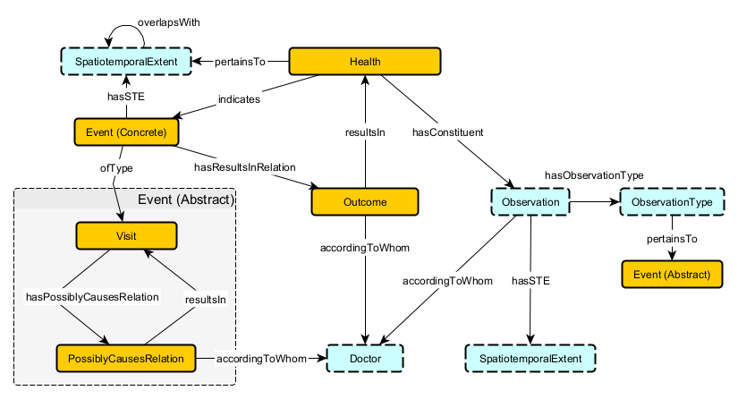

## Outcome

### Axioms
`Outcome`

`accordingToWhom`

`resultsIn`

`hasResultsInRelation`

### Axioms (by Axiom number)

8 Inverse Existential
* `Outcome SubClassOf inverse hasResultsInRelationship some Event`  
An Outcome implies that it results from some Event.

### Axioms Templates
1 Subclass
* `A SubClassOf B`  
Type A implies type B

2 Disjointness
* `A DisjointWith B`  
Type A implies not type B.  type B implies not type A

3 Domain
* `R some owl:Thing SubClassOf A`  
Relationship R implies type A

4 Scoped Domain
* `R some B SubClassOf A`  
Relationship R with type B implies type A

5 Global Range
* `owl:Thing SubClassOf R only B`  
Relationship R implies type B

6 Scoped Range
* `A SubClassOf R only B`  
Relationship R from type A implies type B

7 Existential
* `A SubClassOf R some B`  
Type A imples relationship R with type B

8 Inverse Existential
* `B SubClassOf inverse R some A`  
Type B implies relationship R from type A

9 Functionality
* `owl:Thing SubClassOf R max 1 owl:Thing`  
Either no relationship R or exactly 1 relationship R out

10 Qualified Functionality
* `owl:Thing SubClassOf R max 1 B`  
Either no relationship R or exactly 1 relationship R with type B

11 Scoped Functionality
* `A SubClassOf R max 1 owl:Thing`  
Type A implies either no relationship R or exactly 1 relationship R

12 Qualified Scoped Functionality
* `A SubClassOf R max 1 B`  
Type A implies either no relationship R or exactly 1 relationship R with type B

13 Inverse Functionality
* `owl:Thing SubClassOf inverse R max 1 owl:Thing`  
Either no relationship R or exactly 1 relationship R in

14 Inverse Qualified Functionality
* `owl:Thing SubClassOf inverse R max 1 A`  
Either no relationship R or exactly 1 relationship R from type A

15 Inverse Scoped Functionality
* `B SubClassOf inverse R max 1 owl:Thing`  
Type B implies either no relationship R or exactly 1 relationship R in

16 Inverse Qualified Scoped Functionality
* `B SubClassOf inverse R max 1 A`  
Type B imples either no relationship R or exactly 1 relationship R from type A

17
* `A SubClassOf R min 0 B`  
Type A implies may exist relationship R with type B
