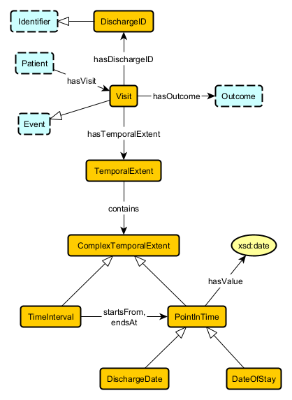

## Temporal Extent

### Axioms

## Visit hasTemporalExtent TemporalExtent
disjoint: `Visit DisjointWith TemporalExtent`

existential: `Visit SubClassOf hasTemporalExtent some TemporalExtent`

functionality: `owl:Thing SubClassOf hasTemporalExtent max 1 owl:Thing`

global range: `owl:Thing SubClassOf hasTemporalExtent only TemporalExtent`

inverse functionality: `owl:Thing SubClassOf inverse hasTemporalExtent max 1 owl:Thing`

inverse qualified functionality: `owl:Thing SubClassOf inverse hasTemporalExtent max 1 Visit`

inverse qualified scoped functionality: `TemporalExtent SubClassOf inverse hasTemporalExtent max 1 Visit`

inverse scoped functionality: `TemporalExtent SubClassOf inverse hasTemporalExtent max 1 owl:Thing`

qualified functionality: `owl:Thing SubClassOf hasTemporalExtent max 1 TemporalExtent`

qualified scoped functionality: `Visit SubClassOf hasTemporalExtent max 1 TemporalExtent`

scoped functionality: `Visit SubClassOf hasTemporalExtent max 1 owl:Thing`

scoped range: `Visit SubClassOf hasTemporalExtent some TemporalExtent`

structural tautology: `TemporalExtent SubClassOf hasTemporalExtent min 0 Visit`

## TemporalExtent contains ComplexTemporalExtent
disjoint: `TemporalExtent DisjointWith ComplexTemporalExtent`

existential: `TemporalExtent SubClassOf contains some ComplexTemporalExtent`

inverse existential: `ComplexTemporalExtent SubClassOf inverse contains some TemporalExtent`

inverse qualified scoped functionality: `ComplexTemporalExtent SubClassOf inverse contains max 1 TemporalExtent`

inverse scoped functionality: `ComplexTemporalExtent SubClassOf inverse contains max 1 owl:Thing`

qualified functionality: `owl:Thing SubClassOf contains max 1 ComplexTemporalExtent`

qualified scoped functionality: `TemporalExtent SubClassOf contains max 1 ComplexTemporalExtent`

scoped domain: `contains some ComplexTemporalExtent SubClassOf TemporalExtent`

scoped functionality: `TemporalExtent SubClassOf contains max 1 owl:Thing`

scoped range: `TemporalExtent SubClassOf contains some ComplexTemporalExtent`

structural tautology: `ComplexTemporalExtent SubClassOf contains min 0 TemporalExtent`

## TimeInterval startsFrom PointInTime
disjoint: `TimeInterval DisjointWith PointInTime`

existential: `TimeInterval SubClassOf startsFrom some PointInTime`

functionality: `owl:Thing SubClassOf startsFrom max 1 owl:Thing`

global domain: `startsFrom some owl:Thing SubClassOf TimeInterval`

global range: `owl:Thing SubClassOf startsFrom only PointInTime`

qualified functionality: `owl:Thing SubClassOf startsFrom max 1 PointInTime`

qualified scoped functionality: `TimeInterval SubClassOf startsFrom max 1 PointInTime`

scoped domain: `startsFrom some PointInTime SubClassOf TimeInterval`

scoped functionality: `TimeInterval SubClassOf startsFrom max 1 owl:Thing`

scoped range: `TimeInterval SubClassOf startsFrom some PointInTime`

structural tautology: `PointInTime SubClassOf startsFrom min 0 TimeInterval`

## TimeInterval endsAt PointInTime
disjoint: `TimeInterval DisjointWith PointInTime`

existential: `TimeInterval SubClassOf endsAt some PointInTime`

functionality: `owl:Thing SubClassOf endsAt max 1 owl:Thing`

global domain: `endsAt some owl:Thing SubClassOf TimeInterval`

global range: `owl:Thing SubClassOf endsAt only PointInTime`

qualified functionality: `owl:Thing SubClassOf endsAt max 1 PointInTime`

qualified scoped functionality: `TimeInterval SubClassOf endsAt max 1 PointInTime`

scoped domain: `endsAt some PointInTime SubClassOf TimeInterval`

scoped functionality: `TimeInterval SubClassOf endsAt max 1 owl:Thing`

scoped range: `TimeInterval SubClassOf endsAt some PointInTime`

structural tautology: `PointInTime SubClassOf endsAt min 0 TimeInterval`

## TimeInterval SubClassOf ComplexTemporalExtent
structural tautology: `ComplexTemporalExtent SubClassOf min 0 TimeInterval`

subclass: `TimeInterval SubClassOf ComplexTemporalExtent`

## PointInTime SubClassOf ComplexTemporalExtent
structural tautology: `ComplexTemporalExtent SubClassOf min 0 PointInTime`

subclass: `PointInTime SubClassOf ComplexTemporalExtent`

## DischargeDate SubClassOf PointInTime
structural tautology: `PointInTime SubClassOf min 0 DischargeDate`

subclass: `DischargeDate SubClassOf PointInTime`

## DateOfStay SubClassOf PointInTime
structural tautology: `PointInTime SubClassOf min 0 DateOfStay`

subclass: `DateOfStay SubClassOf PointInTime`

