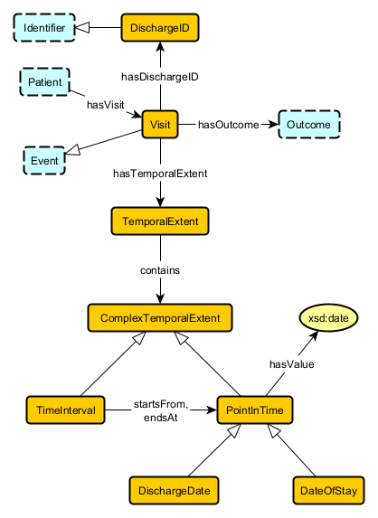

## Visit

### Axioms

## Visit hasDischargeID DischargeID
disjoint: `Visit DisjointWith DischargeID`

existential: `Visit SubClassOf hasDischargeID some DischargeID`

functionality: `owl:Thing SubClassOf hasDischargeID max 1 owl:Thing`

global range: `owl:Thing SubClassOf hasDischargeID only DischargeID`

inverse existential: `DischargeID SubClassOf inverse hasDischargeID some Visit`

inverse functionality: `owl:Thing SubClassOf inverse hasDischargeID max 1 owl:Thing`

inverse qualified functionality: `owl:Thing SubClassOf inverse hasDischargeID max 1 Visit`

inverse qualified scoped functionality: `DischargeID SubClassOf inverse hasDischargeID max 1 Visit`

inverse scoped functionality: `DischargeID SubClassOf inverse hasDischargeID max 1 owl:Thing`

qualified functionality: `owl:Thing SubClassOf hasDischargeID max 1 DischargeID`

qualified scoped functionality: `Visit SubClassOf hasDischargeID max 1 DischargeID`

scoped functionality: `Visit SubClassOf hasDischargeID max 1 owl:Thing`

scoped range: `Visit SubClassOf hasDischargeID some DischargeID`

structural tautology: `DischargeID SubClassOf hasDischargeID min 0 Visit`

## Visit hasOutcome Outcome
disjoint: `Visit DisjointWith Outcome`

existential: `Visit SubClassOf hasOutcome some Outcome`

functionality: `owl:Thing SubClassOf hasOutcome max 1 owl:Thing`

global range: `owl:Thing SubClassOf hasOutcome only Outcome`

inverse existential: `Outcome SubClassOf inverse hasOutcome some Visit`

inverse functionality: `owl:Thing SubClassOf inverse hasOutcome max 1 owl:Thing`

inverse qualified functionality: `owl:Thing SubClassOf inverse hasOutcome max 1 Visit`

inverse qualified scoped functionality: `Outcome SubClassOf inverse hasOutcome max 1 Visit`

inverse scoped functionality: `Outcome SubClassOf inverse hasOutcome max 1 owl:Thing`

qualified functionality: `owl:Thing SubClassOf hasOutcome max 1 Outcome`

qualified scoped functionality: `Visit SubClassOf hasOutcome max 1 Outcome`

scoped functionality: `Visit SubClassOf hasOutcome max 1 owl:Thing`

scoped range: `Visit SubClassOf hasOutcome some Outcome`

structural tautology: `Outcome SubClassOf hasOutcome min 0 Visit`

## Visit hasTemporalExtent TemporalExtent
disjoint: `Visit DisjointWith TemporalExtent`

existential: `Visit SubClassOf hasTemporalExtent some TemporalExtent`

functionality: `owl:Thing SubClassOf hasTemporalExtent max 1 owl:Thing`

global range: `owl:Thing SubClassOf hasTemporalExtent only TemporalExtent`

inverse functionality: `owl:Thing SubClassOf inverse hasTemporalExtent max 1 owl:Thing`

inverse qualified functionality: `owl:Thing SubClassOf inverse hasTemporalExtent max 1 Visit`

inverse qualified scoped functionality: `TemporalExtent SubClassOf inverse hasTemporalExtent max 1 Visit`

inverse scoped functionality: `TemporalExtent SubClassOf inverse hasTemporalExtent max 1 owl:Thing`

qualified functionality: `owl:Thing SubClassOf hasTemporalExtent max 1 TemporalExtent`

qualified scoped functionality: `Visit SubClassOf hasTemporalExtent max 1 TemporalExtent`

scoped functionality: `Visit SubClassOf hasTemporalExtent max 1 owl:Thing`

scoped range: `Visit SubClassOf hasTemporalExtent some TemporalExtent`

structural tautology: `TemporalExtent SubClassOf hasTemporalExtent min 0 Visit`

## Visit leadsTo Labs-Imaging
disjoint: `Visit DisjointWith Labs-Imaging`

inverse functionality: `owl:Thing SubClassOf inverse leadsTo max 1 owl:Thing`

inverse qualified functionality: `owl:Thing SubClassOf inverse leadsTo max 1 Visit`

inverse qualified scoped functionality: `Labs-Imaging SubClassOf inverse leadsTo max 1 Visit`

inverse scoped functionality: `Labs-Imaging SubClassOf inverse leadsTo max 1 owl:Thing`

structural tautology: `Labs-Imaging SubClassOf leadsTo min 0 Visit`

## Patient hasVisit Visit
disjoint: `Patient DisjointWith Visit`

existential: `Patient SubClassOf hasVisit some Visit`

global domain: `hasVisit some owl:Thing SubClassOf Patient`

global range: `owl:Thing SubClassOf hasVisit only Visit`

inverse existential: `Visit SubClassOf inverse hasVisit some Patient`

inverse functionality: `owl:Thing SubClassOf inverse hasVisit max 1 owl:Thing`

inverse qualified functionality: `owl:Thing SubClassOf inverse hasVisit max 1 Patient`

inverse qualified scoped functionality: `Visit SubClassOf inverse hasVisit max 1 Patient`

inverse scoped functionality: `Visit SubClassOf inverse hasVisit max 1 owl:Thing`

scoped domain: `hasVisit some Visit SubClassOf Patient`

scoped range: `Patient SubClassOf hasVisit some Visit`

structural tautology: `Visit SubClassOf hasVisit min 0 Patient`

## Health isAssociatedWith Visit
disjoint: `Health DisjointWith Visit`

existential: `Health SubClassOf isAssociatedWith some Visit`

scoped range: `Health SubClassOf isAssociatedWith some Visit`

structural tautology: `Visit SubClassOf isAssociatedWith min 0 Health`

## Gender isAssociatedWith Visit
disjoint: `Gender DisjointWith Visit`

existential: `Gender SubClassOf isAssociatedWith some Visit`

scoped range: `Gender SubClassOf isAssociatedWith some Visit`

structural tautology: `Visit SubClassOf isAssociatedWith min 0 Gender`

## Ethnicity isAssociatedWith Visit
disjoint: `Ethnicity DisjointWith Visit`

existential: `Ethnicity SubClassOf isAssociatedWith some Visit`

scoped range: `Ethnicity SubClassOf isAssociatedWith some Visit`

structural tautology: `Visit SubClassOf isAssociatedWith min 0 Ethnicity`

## Race isAssociatedWith Visit
disjoint: `Race DisjointWith Visit`

existential: `Race SubClassOf isAssociatedWith some Visit`

scoped range: `Race SubClassOf isAssociatedWith some Visit`

structural tautology: `Visit SubClassOf isAssociatedWith min 0 Race`

## Age isAssociatedWith Visit
disjoint: `Age DisjointWith Visit`

existential: `Age SubClassOf isAssociatedWith some Visit`

scoped range: `Age SubClassOf isAssociatedWith some Visit`

structural tautology: `Visit SubClassOf isAssociatedWith min 0 Age`

## PatientType isAssociatedWith Visit
disjoint: `PatientType DisjointWith Visit`

existential: `PatientType SubClassOf isAssociatedWith some Visit`

scoped range: `PatientType SubClassOf isAssociatedWith some Visit`

structural tautology: `Visit SubClassOf isAssociatedWith min 0 PatientType`

## PriorityOfAdmission isAssociatedWith Visit
disjoint: `PriorityOfAdmission DisjointWith Visit`

existential: `PriorityOfAdmission SubClassOf isAssociatedWith some Visit`

scoped range: `PriorityOfAdmission SubClassOf isAssociatedWith some Visit`

structural tautology: `Visit SubClassOf isAssociatedWith min 0 PriorityOfAdmission`

## Diagnosis isAssociatedWith Visit
disjoint: `Diagnosis DisjointWith Visit`

existential: `Diagnosis SubClassOf isAssociatedWith some Visit`

scoped range: `Diagnosis SubClassOf isAssociatedWith some Visit`

structural tautology: `Visit SubClassOf isAssociatedWith min 0 Diagnosis`

## Visit leadsTo Labs-Imaging
scoped domain: `leadsTo some Labs-Imaging SubClassOf Visit`

## Visit SubClassOf Event
structural tautology: `Event SubClassOf min 0 Visit`

subclass: `Visit SubClassOf Event`

## DischargeID SubClassOf Identifier
structural tautology: `Identifier SubClassOf min 0 DischargeID`

subclass: `DischargeID SubClassOf Identifier`

