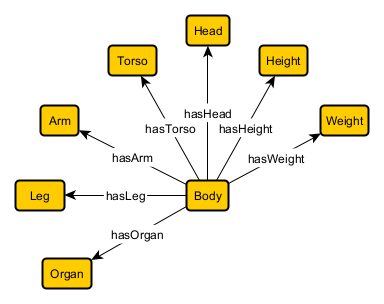
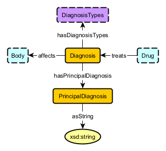
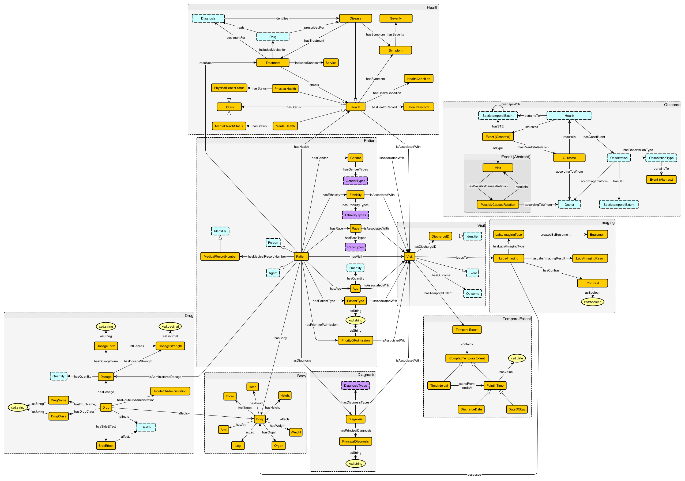

# Schema Diagrams

## Patient

## Health

## Body

## Diagnosis

## Visit

## Drug

## Outcome

## Integrated Schema

### Notes:
For additional detail, pdf versions of each of the Schema Digrams are available in the appropriate folders
